# Student Bulk Creation & Allocation Flow

## Mermaid Diagram

```mermaid
flowchart TD
    Start([Bulk Student Creation Request]) --> ValidateAuth{Check Authorization:<br/>STUDENT_SECTION Role?}
    ValidateAuth -->|No| Error1[Return 403: Not Authorized]
    ValidateAuth -->|Yes| ValidateInput[Validate Input:<br/>- Batch exists<br/>- Department exists<br/>- Filter duplicate emails]
    
    ValidateInput -->|Invalid| Error2[Return 400: Validation Error]
    ValidateInput -->|Valid| GetExistingSections[Get Existing Sections<br/>for Batch & Department]
    
    GetExistingSections --> CalcCapacity[Calculate Available Capacity<br/>in Existing Sections]
    
    CalcCapacity --> NeedSections{Additional Capacity<br/>Needed?<br/>Students > Available}
    
    NeedSections -->|Yes| CalcSectionsNeeded[Calculate Sections Needed:<br/>ceil additionalNeeded / 70]
    CalcSectionsNeeded --> GenSectionCodes[Generate Unique Section Codes<br/>XXXX-XXXX or XXXX_XXXX]
    GenSectionCodes --> CreateSections[Create New Sections<br/>in Database]
    CreateSections --> RefreshSections[Refresh Available<br/>Sections List]
    RefreshSections --> GetExistingRegNos
    
    NeedSections -->|No| GetExistingRegNos[Get All Existing<br/>Registration Numbers]
    
    GetExistingRegNos --> Step1[Step 1: Divide Students by Gender]
    Step1 --> MaleGroup[MALE Students]
    Step1 --> FemaleGroup[FEMALE Students]
    Step1 --> OtherGroup[OTHER Students]
    
    MaleGroup --> InitSections[Initialize Section Tracking:<br/>- Current Count<br/>- Male Count<br/>- Female Count<br/>- Other Count<br/>- Max Capacity: 70]
    FemaleGroup --> InitSections
    OtherGroup --> InitSections
    
    InitSections --> Step2[Step 2 & 3: Allocate Students<br/>Maintaining Gender Balance]
    
    Step2 --> AllocLoop{More Students<br/>to Allocate?}
    
    AllocLoop -->|Yes| CheckMale{Male Index<br/>< Length?}
    CheckMale -->|Yes| FindBestMale[Find Best Section for MALE:<br/>1. Sort by Available Capacity<br/>2. Sort by Gender Balance]
    FindBestMale --> GenRegNoMale[Generate Unique<br/>Registration Number<br/>7-8 chars alphanumeric]
    GenRegNoMale --> GenPasswordMale[Generate Random<br/>Password & Hash]
    GenPasswordMale --> AllocateMale[Allocate to Section:<br/>- Update section.currentCount<br/>- Update section.maleCount<br/>- Increment maleIndex]
    
    AllocLoop --> CheckFemale{Female Index<br/>< Length?}
    CheckFemale -->|Yes| FindBestFemale[Find Best Section for FEMALE:<br/>1. Sort by Available Capacity<br/>2. Sort by Gender Balance]
    FindBestFemale --> GenRegNoFemale[Generate Unique<br/>Registration Number<br/>7-8 chars alphanumeric]
    GenRegNoFemale --> GenPasswordFemale[Generate Random<br/>Password & Hash]
    GenPasswordFemale --> AllocateFemale[Allocate to Section:<br/>- Update section.currentCount<br/>- Update section.femaleCount<br/>- Increment femaleIndex]
    
    AllocLoop --> CheckOther{Other Index<br/>< Length?}
    CheckOther -->|Yes| FindBestOther[Find Best Section for OTHER:<br/>1. Sort by Available Capacity<br/>2. Sort by Gender Balance]
    FindBestOther --> GenRegNoOther[Generate Unique<br/>Registration Number<br/>7-8 chars alphanumeric]
    GenRegNoOther --> GenPasswordOther[Generate Random<br/>Password & Hash]
    GenPasswordOther --> AllocateOther[Allocate to Section:<br/>- Update section.currentCount<br/>- Update section.otherCount<br/>- Increment otherIndex]
    
    AllocateMale --> AllocLoop
    AllocateFemale --> AllocLoop
    AllocateOther --> AllocLoop
    
    AllocLoop -->|No| Step4[Step 4: Check for Sections<br/>with Low Student Count]
    
    Step4 --> CheckMin{For Each Section:<br/>Total Students<br/>= Existing + New<br/>< MIN 5?}
    
    CheckMin -->|Yes| MarkReallocate[Mark Section for<br/>Reallocation]
    CheckMin -->|No| Step5
    MarkReallocate --> Step5[Step 5: Reallocate Students<br/>from Low-Count Sections]
    
    Step5 --> ReallocLoop{More Sections<br/>to Reallocate?}
    
    ReallocLoop -->|Yes| FindNewSection[For Each Student:<br/>Find Better Section<br/>Maintaining Gender Balance]
    FindNewSection --> MoveStudent{New Section<br/>Available &<br/>Has Capacity?}
    
    MoveStudent -->|Yes| UpdateOldSection[Remove from Old Section:<br/>- Decrement currentCount<br/>- Decrement gender count]
    UpdateOldSection --> UpdateNewSection[Add to New Section:<br/>- Increment currentCount<br/>- Increment gender count<br/>- Update student.sectionId]
    
    MoveStudent -->|No| ReallocLoop
    UpdateNewSection --> ReallocLoop
    
    ReallocLoop -->|No| CreateStudents[Create All Students<br/>in Database]
    
    CreateStudents --> SendEmails[Send Welcome Emails via Kafka:<br/>- Email<br/>- Name<br/>- Registration Number<br/>- Temporary Password<br/>- College Name<br/>- Department Name]
    
    SendEmails --> Success([Return Success Response:<br/>- Students Created<br/>- Sections Created<br/>- Section Summary with Gender Distribution])
    
    Error1 --> End([End])
    Error2 --> End
    Success --> End
    
    style Start fill:#e1f5ff
    style Success fill:#d4edda
    style Error1 fill:#f8d7da
    style Error2 fill:#f8d7da
    style Step1 fill:#fff3cd
    style Step2 fill:#fff3cd
    style Step4 fill:#fff3cd
    style Step5 fill:#fff3cd
    style AllocLoop fill:#d1ecf1
    style ReallocLoop fill:#d1ecf1
    style NeedSections fill:#e2e3ff
    style CreateSections fill:#d4edda
```



## Key Features

### 1. **Automatic Section Creation**
   - System calculates how many sections are needed based on student count
   - Automatically creates new sections if existing capacity is insufficient
   - Each section has a maximum capacity of 70 students
   - Generates unique section codes (XXXX-XXXX format)

### 2. **Gender-Based Division**
   - Students are divided into MALE, FEMALE, and OTHER groups
   - Enables balanced allocation across sections

### 3. **Section Tracking**
   - Tracks current capacity (existing + new students)
   - Maintains gender counts per section
   - Maximum capacity: 70 students per section

### 4. **Smart Allocation Algorithm**
   - **findBestSection()** function:
     - Primary: Sorts by available capacity (maximize utilization)
     - Secondary: Sorts by gender balance (maintain good ratio)
   - Alternates between male and female students for balanced distribution

### 5. **Registration Number Generation**
   - 7-8 character alphanumeric codes
   - Excludes ambiguous characters (0, O, I, 1)
   - Ensures uniqueness across all students

### 6. **Reallocation Logic**
   - Identifies sections with total students < 5 (existing + new)
   - Reallocates students to sections with better capacity
   - Maintains gender balance during reallocation

### 7. **Email Notification**
   - Sends welcome emails via Kafka
   - Includes registration number and temporary password
   - Provides college and department information

## Algorithm Details

### Auto Section Creation Logic
```
existingCapacity = sum(70 - section.students.length) for each section
additionalCapacityNeeded = totalStudents - existingCapacity
sectionsNeeded = ceil(additionalCapacityNeeded / 70)
```

### Allocation Priority
1. **Capacity Maximization**: Fill sections to maximum capacity (70)
2. **Gender Balance**: Maintain good male-to-female ratio
3. **Alternating Allocation**: Process male and female students alternately

### Reallocation Criteria
- **Minimum Threshold**: 5 students per section (existing + new)
- **Target**: Sections with more available capacity
- **Constraint**: Maintain gender balance

## New Improvements

### 1. **Dry Run Mode**
Preview allocation without creating any data:
```json
{
  "students": [...],
  "batchId": "...",
  "departmentId": "...",
  "dryRun": true
}
```

### 2. **Phone Number Validation**
- Checks for duplicate phone numbers in database
- Checks for duplicate phone numbers within input
- Detailed validation error reporting

### 3. **Meaningful Section Codes**
Format: `DEPT-YY-SXXX` (e.g., `CSE-24-S1A2B`)
- DEPT: Department short name
- YY: Batch year (last 2 digits)
- S: Section prefix
- XXX: Random suffix

### 4. **Existing Gender Distribution**
- Considers existing student gender counts in sections
- Better ratio calculation for new allocations

### 5. **Transaction Support**
- All database operations wrapped in transaction
- Automatic rollback on failure

### 6. **Parallel Email Sending**
- Welcome emails sent in parallel for better performance

## Response Format

### Actual Creation Response
```json
{
  "success": true,
  "message": "100 student(s) created successfully. 2 new section(s) were automatically created.",
  "data": {
    "created": 100,
    "total": 100,
    "sectionsCreated": 2,
    "totalSections": 3,
    "sectionCapacity": 70,
    "genderBreakdown": {
      "male": 50,
      "female": 45,
      "other": 5
    },
    "sectionSummary": [
      {
        "sectionNo": "CSE-24-S1A2B",
        "isNewSection": false,
        "existingStudents": 20,
        "newlyAllocated": 35,
        "genderDistribution": {
          "existing": { "male": 10, "female": 8, "other": 2 },
          "new": { "male": 18, "female": 16, "other": 1 },
          "total": { "male": 28, "female": 24, "other": 3 }
        },
        "totalInSection": 55,
        "availableCapacity": 15
      }
    ],
    "students": [...]
  }
}
```

### Dry Run Response
```json
{
  "success": true,
  "dryRun": true,
  "message": "Dry run completed. No data was created.",
  "preview": {
    "studentsToCreate": 100,
    "sectionsToCreate": 2,
    "totalSectionsAfter": 3,
    "sectionCapacity": 70,
    "genderBreakdown": { "male": 50, "female": 45, "other": 5 },
    "sectionAllocation": [...],
    "students": [...]
  }
}
```

### Validation Error Response
```json
{
  "success": false,
  "message": "Some students could not be created due to validation errors",
  "errors": [
    {
      "index": 0,
      "field": "email",
      "value": "john@example.com",
      "message": "Email 'john@example.com' already exists in database"
    },
    {
      "index": 3,
      "field": "phone",
      "value": "+1234567890",
      "message": "Duplicate phone '+1234567890' in input"
    }
  ],
  "invalidCount": 2,
  "validCount": 98,
  "totalSubmitted": 100
}
```

